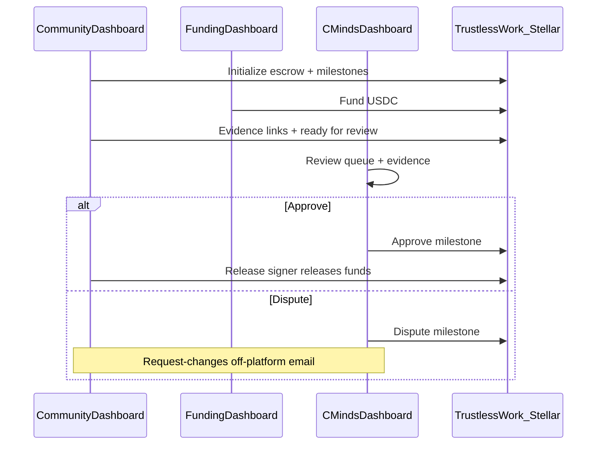
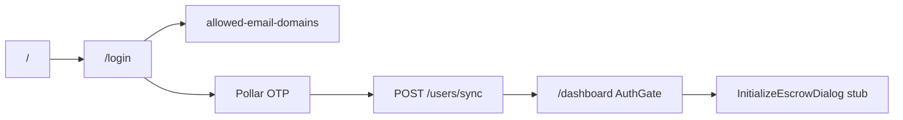

# Flujo CMinds Dashboard — estudio (docs vs código)

## Rol de CMinds en el piloto (§6.3, §7)

CMinds es el **operador de plataforma**: Milestone Approver + Dispute Resolver + Platform Address.

| TW Role            | Actor v1     | App                |
| ------------------ | ------------ | ------------------ |
| Milestone Approver | CMinds       | `cminds-dashboard` |
| Dispute Resolver   | CMinds       | `cminds-dashboard` |
| Platform Address   | CMinds admin | `cminds-dashboard` |

No crea escrows ni libera fondos. Eso lo hacen Community (init / evidence / release) y Funding (depósito USDC).

---

## Posición en el flujo end-to-end

CMinds entra **después** de evidence “ready for review” y **antes** del release (§8.3 → §8.4 → §8.5).

---

## Flujo objetivo del operador (§8.4, §12, §14.2)

### 1. Entrada / auth

- Login (docs: wallet Freighter; código actual: email OTP Pollar + allowlist de dominios).
- Rol: `CMINDS_OPERATOR`.

### 2. Monitoreo

- Ver escrows propuestos / inicializados.
- Ver funding status y release history.
- Revisar tasks seleccionadas y montos fijos por milestone.

### 3. Revisión de milestone (§8.4 — núcleo v1)

1. Abrir review dashboard.
2. Ver cola de milestones en **Ready for Review**.
3. Abrir evidencia (links: fotos, reports, etc.).
4. **Approve** o **Dispute**.
5. Si dispute → milestone no se libera; aclaraciones por email (sin workflow in-app, §12.4 / §5.2).

### 4. Admin (§12.3)

- Pause / cancel escrow.
- Add milestones vía platform address (§14.2).

### Status relevante (docs)

- Milestone: `Pending → In Progress → Ready for Review → Approved | Disputed → Released`
- Escrow: `Initialized → Funded / Partially Funded → Active → Paused | Cancelled | Completed`

**Reglas críticas:** milestones no secuenciales; approve/release independientes; no editar milestone una vez actualizado el status; amounts fijos (no %).

---

## Qué exige §14.2 (checklist producto)

- Wallet login
- View proposed / initialized escrows
- Review tasks, amounts, evidence links
- Approve / dispute milestone
- Admin pause/cancel
- Add milestones (platform address)
- View funding status + release history
- Funder-facing visibility (soporte)

---

## Estado actual del código

| Capacidad docs                        | Hoy en `cminds-dashboard`                                                                                                                                                                                          |
| ------------------------------------- | ------------------------------------------------------------------------------------------------------------------------------------------------------------------------------------------------------------------ |
| Auth + rol `CMINDS_OPERATOR`          | Implementado: [`login/page.tsx`](apps/cminds-dashboard/src/app/login/page.tsx) → Pollar email + `enforceAllowedEmailDomain`; [`dashboard/page.tsx`](apps/cminds-dashboard/src/app/dashboard/page.tsx) → `AuthGate` |
| Review queue / evidence               | No existe                                                                                                                                                                                                          |
| Approve / dispute UI                  | No cableado (primitives en `@repo/tw-blocks`, sin usar)                                                                                                                                                            |
| Pause/cancel, add milestones          | No                                                                                                                                                                                                                 |
| Funding / release history             | No                                                                                                                                                                                                                 |
| Feature folders `escrow-review`, etc. | No hay `src/features/`                                                                                                                                                                                             |
| core-api escrows/milestones           | Solo `users` + `allowed-email-domains`                                                                                                                                                                             |

Lo que hay en `/dashboard` hoy: copy de operador + **`InitializeEscrowDialog`** (acción de Community, no de CMinds).

---

## Conclusión

El **flujo de producto** está bien definido en docs: cola de review → evidencia → approve/dispute → (admin pause/cancel). El **código** solo cubre el cascarón de auth; el trabajo de v1 del dashboard es construir esas pantallas encima de TW approve/dispute blocks + API off-chain de escrows/evidence cuando exista.

Sin escrows/milestones en `core-api`, el review queue no puede ser full-stack todavía: o se lista por rol on-chain (`useEscrowsByRoleQuery` en tw-blocks) o se espera el módulo de persistencia off-chain.
